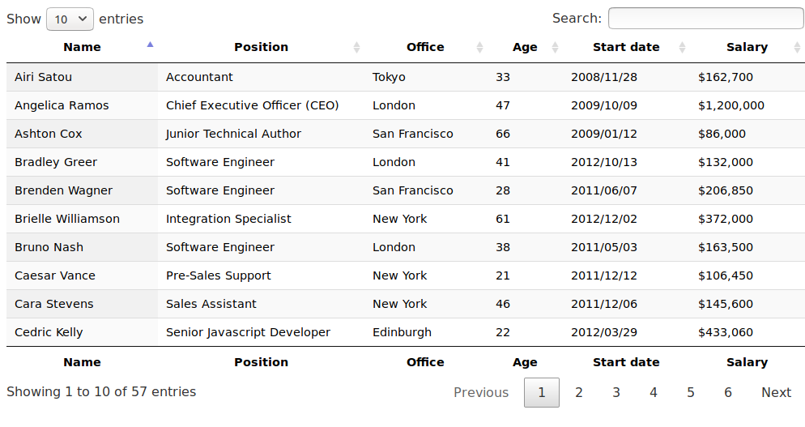

# vue-mdb-datatables
plantilla de vuejs con mdb utilizando datatables - creado todo con CDN

Para crear la tabla utilizamos el modulo datatables :

https://datatables.net/
https://datatables.net/examples/basic_init/zero_configuration.html

Tambien utilizamos la plantilla vue con mdb, que nos ofrece mdbootstrap.

https://mdbootstrap.com/docs/vue/getting-started/quick-start/
